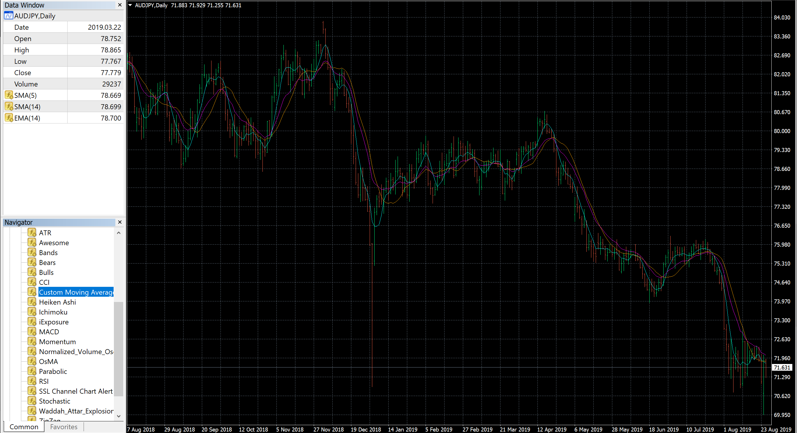

# Forex Data Modules

## What is this?
This is a collection of various modules that I use for procuring data relevant 
to the foreign exchange market, commonly referred to as forex. 

Currencies are traded in pairs, for
example the US Dollar against the Japanese Yen would be represented as 
USD/JPY). 

Currency pairs are traded in lots, in which you can enter either a short or
long position.  Using USD/JPY as our example, if I wanted to enter a trade
on the premise that USD would appreciate in value relative to JPY, I would
go **long**. Conversely, I would go **short** if the opposite were true.
   
Lot size as of right now is not relevant to any posted modules.  This may be
 a consideration for future projects as it relates to money management and
  risk profile situations, but the primary focus will be on **backtesting**
  
  All of my backtesting and results are based on the **daily** timeframe
  .  All definitions will be referenced as such.
## How does backtesting work?

Backtesting is where I analyze the history of multiple different currency
 pairs over time.  My approach relies heavily on the use of 
 **indicators**, so determining the efficacy and appropriate applications of
  these indicators via backtesting is essential to success in this system.
  
## What are indicators?
 
Indicators are essentially graphs and statistics providing
  some result(s) when measured against data.  An easy way to think about this
   is an average of data points, measured and graphed over time.

The Simple Moving Average is an example of a very basic and effective
 indicator. This calculates the average of values over a given time period
 , and this time period can be customized.  We can utilize a SMA(5), which
  gives us the average of prices over the last 5 days, or a SMA(14) which
   does the same over a 14 day period.
   
   It is also important to keep in mind that days refer to market days, not
    calendar days.  As Forex markets are open Monday-Friday, a 5 day period
     is commonly used to represent 1 week of data.
     
Let's go to an example. I'll use 10 integers in a close range to represent
 price movement over a 10 day period

```
import pandas as pd
import random
import plotly.graph_objects as go

data = {'value': [10, 11, 11, 12, 18, 16, 14, 10, 11, 13]}

# Create dataframe
df = pd.DataFrame(data)
```

| date | value |
|------|-------|
| 0    | 10    |
| 1    | 11    |
| 2    | 11    |
| 3    | 12    |
| 4    | 18    |
| 5    | 16    |
| 6    | 14    |
| 7    | 10    |
| 8    | 11    |
| 9    | 13    |

I'll use a Simple Moving Average with a period of 2 for this data.

```
# Calculate the moving average, where x in window=x is the number of
# periods calculated

df.rolling(window=2).mean()
```

| date | value | sma2 |
|------|-------|------|
| 0    | 10    | nan  |
| 1    | 11    | 10.5 |
| 2    | 11    | 11   |
| 3    | 12    | 11.5 |
| 4    | 18    | 15   |
| 5    | 16    | 17   |
| 6    | 14    | 15   |
| 7    | 10    | 12   |
| 8    | 11    | 10.5 |
| 9    | 13    | 12   |

The following is a representation of how the data will look on a trading
 platform or website.  Note that the first row of data is excluded, as a
  Simple Moving Average of 2 will not provide a value for only one data point.  


# Measuring data in MetaTrader 4

## How do we find this data?

MetaTrader4 is a trading platform that works in conjunction with many major
 trading platforms, including OANDA and Forex.com, two of the only brokers
  available to forex traders in the United States.  I am using OANDA's
   MetaTrader4 platform for my backtesting and extracting the data from there
    for indicator analysis. 
    
   Here is an example of an typical window in MetaTrader 4.  

   


Lets break down what we see here:

- The Data Window: 

    This is the main window where I extract my information.  It contains the
     boilerplate information: Date, Open, High, Low, Close, and Volume.

     - The Open is the level where price was at the beginning of the day.
     - The High is the highest that price has reached that day.
     - The Low is the lowest that price has reached that day.
     - The Close is the level where price was at the end of the day
     - The Volume represents total relative trading activity that day
     
    We can also see that we have SMA(5), SMA(14) and EMA(14) listed.  This is
     our Simple Moving Average 5 and Simple Moving Average 14, and
      Exponential Moving Average 14.  This shows us that we can not only
       measure different time frames with the same indicator, but also
        include different indicators over similar time frames to measure
         their individual effectiveness.
         
- The Navigator Window:  

    This contains various indicators, both pre-installed and external, used
     for backtesting.  Double-clicking on these icons displays a window in
      which we can customize various settings, including the period measured, 
      shift, line style and line color of graph.
      
- The Chart:

    This visualizes our currency pair and indicator data represented in
     graphical format. Each individual bar represents a day, where the high
      and low points represent the High and Low respectively, the left tick
       represents the Open, and the right tick represents the Close. Green
        bars are days where the close was greater than the open, and red bars
         are days where the open was greater than the close.
         
 ## How do we collect this data?
 
A major challenge I encountered was not being able to retrieve indicator data
 in an exportable format. The History Center provides our basic boilerplate
  information, but doesn't seem to include options for including and
   calculating indicator data.  
   
   There were two options I considered at this time:
   
   1. Create a module using PyAutoGUI to cycle through each bar, copy the
    data and paste it into a blank worksheet.  This is simpler and doesn't
     require excessive coding, but is very resource intensive, unintuitive
     , and does not allow for interaction at any time during the process
      unless hard-stopped with a fail safe.
      
   2. Analyze individual indicators to determine their code structure, calculate
    their values (via matplotlib, pandas, etc), and append those values back
     to some columnar data store.  This is much more tidy and customizable
     , and there are much less steps involved with transposing data in Excel
      and creating various csv files.  However it requires a greater degree
       of code, fundamental knowledge of the model, and understanding of the
        MQL5 language (similar to C++) that these modules are written in.
        
   
I decided that a mix of the two was the best approach, as I needed to collect
 some data on which to graph and build future modules. 
 
 - The first method
  resulted in module **dataScraping.py** and is located within this repository
  .  
  
  - The second method
  requires multiple different modules, as each indicator has different
   methods of calculation and therefore different code structure.  A 
    schedule will be posted to this repository listing current and future
     projects to be worked on.
     
## What's next?

*Please note: This section contains various projects and ideas that will be
 heavily edited as they are added, completed or removed.  Real-life
  obligations and technological constraints may affect the timeliness of how
   these are addressed, and if so will be appended with details.*
   
- My trading algorithm follows the 
[No Nonsense Forex approach.](https://nononsenseforex.com/) This incudes six
 major components: 	
    1) ATR
	2) Baseline
	3) Confirmation Indicator
	4) Volume Indicator
	5) 2nd Confirmation Indicator
    6) Exit Indicator
    
    Each indicator that I am testing can function as one or multiple of these
     indicators, and some can function best only when used as multiple (for
      example, an Exponential Moving Average could function best as a
       Baseline **only when** it is also used as an Exit Indicator
       )  
       
     Therefore, future modules should address these parameters and analyze
      not only what works best, but where it does relative to the algorithmic
       structure and to other indicators used as part of this.
     
- News events impact trade entries and exits.  This structure is heavily
 trend-based, as we are looking for patterns in data to determine future
  actions. Consider the chart used in the example above:
  
  
  
  We can see an enormous red bar on January 3rd.  With no other context, we
   can only assume that either the AUD fell, the JPY rose, or both
    concurrently happened.  It is important to be contextually aware of these
     outliers when doing data analysis, as we can analyze other currency
      pairings with the same scrutiny and avoid including these outliers in
       data collection.
       
   It is important to understand that these phenomena can not always be
    explained.  The above situation is referred to as the 
    [Yen Flash Crash](https://www.cnbc.com/2019/01/03/yen-surges-against-global-currencies-after-flash-crash.html)
      and as we can see, even the experts don't have an exact reason as to
       why this particular situation occurred.
       
         