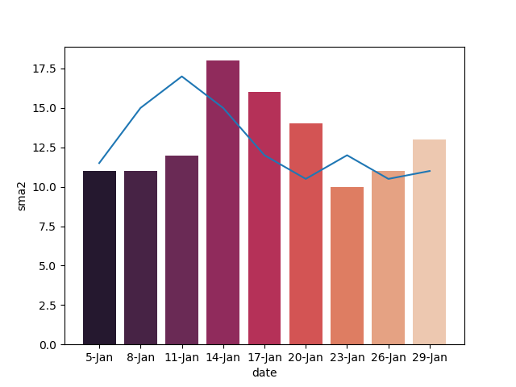

# Forex Data Modules

## What is this? 
This is a collection of various modules that I use for procuring data relevant 
to the foreign exchange market. 

Currencies are traded in pairs, for
example the US Dollar against the Japanese Yen would be represented as 
USD/JPY). 

Currency pairs are traded in lots, in which you can enter either a short or
long position.  Using USD/JPY as our example, if I wanted to enter a trade
on the premise that USD would appreciate in value relative to JPY, I would
go **long**. Conversely, I would go **short** if the opposite were true.
   
Lot size as of right now is not relevant to any posted modules.  This may be
 a consideration for future projects as it relates to money management and
  risk profile situations, but the primary focus will be on **backtesting**
  
## How does backtesting work?

Backtesting is where I analyze the history of multiple different currency
 pairs over time.  My approach relies heavily on the use of 
 **indicators**, so determining the efficacy and appropriate applications of
  these indicators via backtesting is essential to success in this system.
  
## What are indicators?
 
Indicators are essentially graphs and statistics providing
  some result(s) when measured against data.  An easy way to think about this
   is an average of data points, measured and graphed over time.

Let's go to an example. I'll use 10 integers in a close range to represent
 price movement over a 10 day period

```
import pandas as pd
import random
import plotly.graph_objects as go

data = {'value': [10, 11, 11, 12, 18, 16, 14, 10, 11, 13]}

# Create dataframe
df = pd.DataFrame(data)
```

| date | value |
|------|-------|
| 0    | 10    |
| 1    | 11    |
| 2    | 11    |
| 3    | 12    |
| 4    | 18    |
| 5    | 16    |
| 6    | 14    |
| 7    | 10    |
| 8    | 11    |
| 9    | 13    |

```
# Calculate the moving average, where x in window=x is the number of
# periods calculated

df.rolling(window=2).mean()
```

| date | value | sma2 |
|------|-------|------|
| 0    | 10    | nan  |
| 1    | 11    | 10.5 |
| 2    | 11    | 11   |
| 3    | 12    | 11.5 |
| 4    | 18    | 15   |
| 5    | 16    | 17   |
| 6    | 14    | 15   |
| 7    | 10    | 12   |
| 8    | 11    | 10.5 |
| 9    | 13    | 12   |




